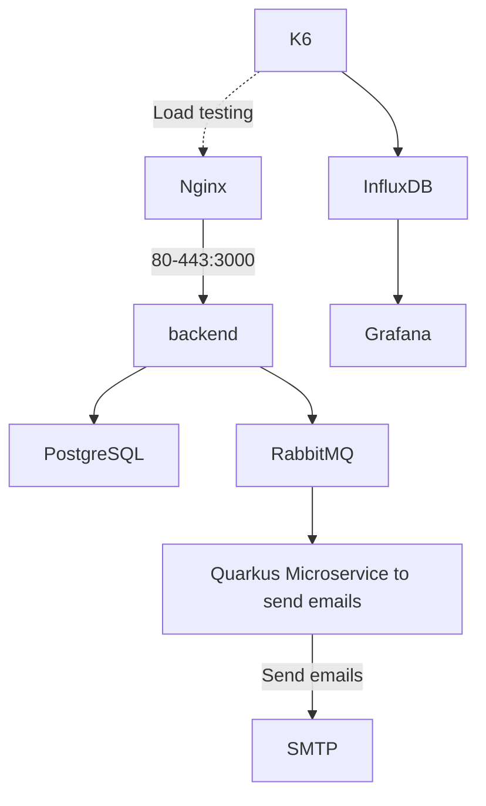
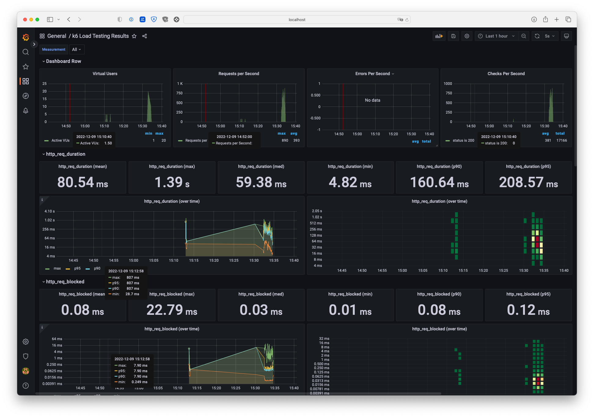

# Software architecture project
## Mael KERICHARD (@Pixselve) - Romain BRIEND (@Yami2200)




## 💻 How to use

```bash
docker-compose up
```

The backend will be available on http://localhost:80.
The SMTP client will be available on http://localhost:1080.

## 🚛 Load Testing the backend

### How to run

1. Start the project
    
    ```bash
    docker-compose up
    ```

2. Start the grafana dashboard and the influxdb database

    ```bash
    cd load-testing
    docker-compose up -d grafana influxdb
    ```

3. Run the load test

    ```bash
    cd load-testing
    docker-compose run --rm k6 run /scripts/all.js
    ```

### Results

The results are available on the grafana dashboard at [http://localhost:3000](http://localhost:3000).
The credentials are `admin` / `admin`.



## 📟 Monitoring

The global architecture is monitored with [Prometheus](https://prometheus.io/) and [Grafana](https://grafana.com/).

Example of NestJS dashboard :


The following services are monitored (each one in a specific dashboard) :
- Backend NestJS
- Backend Quarkus
- RabbitMQ

The monitoring results are available on grafana at [http://localhost:3001](http://localhost:3001).

